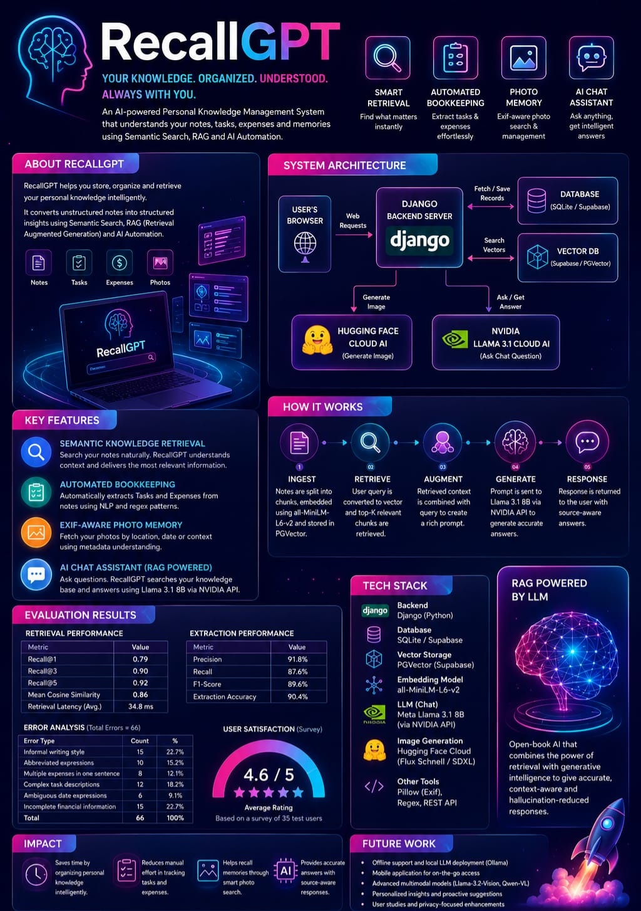

# 🧠 RecallGPT

<div align="center">
  
  <h3>Your AI-Powered Second Brain</h3>
  <p>A privacy-focused personal knowledge management system that lets you chat with your notes, automatically extract tasks and expenses, remember images, and organize your life using Retrieval-Augmented Generation (RAG) and Large Language Models.</p>
</div>

---

## 📖 Overview
RecallGPT is an AI-powered personal assistant built with Django, LangChain, and LLMs that transforms your markdown notes into an intelligent knowledge base.

Instead of manually searching through hundreds of notes, RecallGPT allows you to ask questions in natural language while automatically organizing actionable information like tasks, expenses, and image memories.

The application combines:
* 📝 Personal Note Management
* 💬 AI Chat (RAG)
* ✅ Automatic Task Extraction
* 💰 Intelligent Expense Tracking
* 🖼️ Image Memory with EXIF Metadata
* 📚 Multi-Session Conversations
* 🎨 AI Image Generation

---

## ✨ Features

### 📝 Markdown Note Management
* Upload Markdown (`.md`) and text files.
* User-specific document storage.
* Binary database storage for high portability.
* Automatic vector indexing on update.
* Version-friendly architecture.

### 💬 AI Chat with Your Notes (RAG)
Ask questions in natural language, such as:
* *What did I spend on transportation?*
* *What tasks are still pending?*
* *What did I write about my internship?*

The system performs:
```
Question ➔ Vector Search ➔ Relevant Note Chunks ➔ Prompt Construction ➔ LLM ➔ Answer
```

**Supported LLM Backends:**
* Ollama (Local)
* NVIDIA AI Endpoints
* Google Gemini (optional)

### 🧠 General AI Chat
Separate from note-based chat:
* Chat history retention.
* Multiple parallel conversations.
* Independent chat sessions.
* Context-aware responses.

### ✅ Automatic Task Extraction
RecallGPT scans uploaded notes and extracts tasks automatically. Supported formats:
* `- [ ] Buy groceries`
* `- [x] Submit assignment`
* `TODO: Finish project`
* `Task: Prepare presentation`
* `Action: Call client`

**Tracks:**
* Pending Tasks
* Completed Tasks

### 💰 Expense Tracking
Expenses are automatically detected from notes. Examples:
* *Spent 500 on Coffee*
* *Bought a book for 350*
* *Petrol cost 1200*
* *- Dinner - ₹450*
* *- Lunch: Rs. 180*

**Supported currencies:** `₹`, `$`, `€`, `£`, `INR`, `USD`, `EUR`, `GBP`

### 🖼️ Image Memory
Upload images alongside your memories. RecallGPT stores:
* Camera model
* Capture date
* GPS location
* Description & Tags
* Image metadata

Supports **semantic image recall** during conversations.

### 🎨 AI Image Generation
Generate AI images directly inside the application using natural language prompts.

### 👥 Multi-User Support
Each user gets:
* Private notes & vector database
* Private images & chat history
* Secure authentication & session management

---

## 🏗️ System Architecture

```
                    +--------------------+
                    |    Django Frontend |
                    +---------+----------+
                              |
                    Django REST Framework
                              |
          +-------------------+------------------+
          |                                      |
          |                                      |
      Business Logic                      Authentication
          |                                      |
          +-------------------+------------------+
                              |
                    LangChain Orchestration
                              |
         +--------------------+------------------+
         |                                       |
         |                                       |
   Embedding Model                         LLM Backend
(all-MiniLM-L6-v2)                  Ollama / NVIDIA / Gemini
         |                                       |
         +--------------------+------------------+
                              |
                      Vector Database
               ChromaDB / PostgreSQL pgvector
                              |
                    Retrieved Context
                              |
                        Final Response
```

---

## 🧩 Technology Stack

* **Backend**: Django 6, Django REST Framework
* **AI/RAG**: LangChain, Sentence Transformers, HuggingFace Embeddings, Ollama, NVIDIA AI Endpoints, Google Gemini
* **Database**: PostgreSQL, Supabase, pgvector, SQLite (Development)
* **Vector Database**: ChromaDB, PostgreSQL pgvector
* **Image Processing**: Pillow
* **Production**: Gunicorn, WhiteNoise

---

## 📂 Project Structure

```
RecallGPT
│
├── api/
│   ├── templates/
│   ├── migrations/
│   ├── models.py
│   ├── views.py
│   ├── serializers.py
│   ├── services.py
│   ├── storage.py
│   ├── utils.py
│   ├── urls.py
│   └── admin.py
│
├── recall_project/
│   ├── settings.py
│   ├── urls.py
│   ├── wsgi.py
│   └── asgi.py
│
├── notes/
│
├── manage.py
├── parsers.py
├── requirements.txt
└── README.md
```

---

## ⚙️ Workflow

### Upload Notes
```
Markdown File ➔ Upload API ➔ Database Storage ➔ Chunk Documents ➔ Generate Embeddings ➔ Store in Vector DB
```

### Chat with Notes
```
Question ➔ Similarity Search ➔ Top Relevant Chunks ➔ Prompt Construction ➔ LLM ➔ Generated Answer
```

### Task Extraction
```
Uploaded Notes ➔ Regex Parser ➔ Extract Tasks ➔ Task Dashboard
```

### Expense Extraction
```
Uploaded Notes ➔ Regex Detection ➔ Amount Parsing ➔ Expense Dashboard
```

### Image Memory
```
Upload Image ➔ Extract EXIF ➔ Generate Metadata ➔ Store Image ➔ Semantic Retrieval
```

---

## 📡 API Endpoints

### HTML Pages
| Method | Endpoint | Description |
|---|---|---|
| **GET** | `/` | Dashboard |
| **GET** | `/chat/` | Chat with Notes |
| **GET** | `/general-chat/` | General Assistant Chat |
| **GET** | `/tasks/` | Tasks Overview |
| **GET** | `/expenses/` | Expense Tracker |
| **GET** | `/gallery/` | Memories Gallery |
| **GET** | `/image-studio/` | AI Image Studio |
| **GET** | `/about/` | User Profile |

### REST API
* **Notes**:
  * `POST /api/upload/`
  * `POST /api/retrain/`
  * `GET /api/notes/`
* **Chat**:
  * `POST /api/chat/`
  * `POST /api/general_chat/`
  * `POST /api/sessions/`
  * `GET /api/sessions/`
  * `GET /api/sessions/<id>/messages/`
* **Tasks**:
  * `GET /api/tasks/`
* **Expenses**:
  * `GET /api/expenses/`
* **Images**:
  * `GET /api/gallery/`
  * `POST /api/generate_image/`
* **Utilities**:
  * `GET /api/ollama_status/`
  * `GET /api/media/serve/<filename>`

---

## 🗄️ Database Models

* **User**: `username`, `email`, `password`
* **UserProfile**: Link to User, `phone`, `profile picture`
* **ChatSession**: `title`, `type` ('notes' or 'general'), `created_at`
* **ChatMessage**: Link to ChatSession, `role`, `content`, `timestamp`
* **DatabaseFile**: `filename`, `binary content`, `size`, `updated_at`
* **ImageMemory**: `image`, `description`, `tags`, `location`, `camera`, `uploaded_at`

---

## 🔍 Supported Parsing

* **Tasks**: Checkbox tasks (`- [ ]`), `TODO:`, `Task:`, `Action:`, `To-do:`
* **Expenses**: `Spent 500`, `Paid 250`, `Bought for 300`, `Cost 120`, `Dinner - ₹450`, `Lunch: Rs.180` (Multiple currencies supported).

---

## 🔒 Security

* Django Built-in Authentication
* User Isolation (each user only accesses their own documents and data)
* Protected REST APIs (DRF token/session validation)
* Separate Vector Collections per User
* Environment Variables Configuration (`.env`)

---

## 🚀 Installation

### 1. Clone Repository
```bash
git clone https://github.com/yourusername/RecallGPT.git
cd RecallGPT
```

### 2. Create Virtual Environment
```bash
# Windows
python -m venv venv
venv\Scripts\activate

# Linux/macOS
python -m venv venv
source venv/bin/activate
```

### 3. Install Dependencies
```bash
pip install -r requirements.txt
```

### 4. Configure Environment
Create a `.env` file in the root folder:
```env
SECRET_KEY=your_django_secret_key
DEBUG=True

# DB & Supabase configuration
SUPABASE_DB_HOST=your_host
SUPABASE_DB_NAME=postgres
SUPABASE_DB_USER=postgres
SUPABASE_DB_PASSWORD=your_password
SUPABASE_DB_PORT=5432

# HF / NVIDIA tokens
HF_TOKEN=your_huggingface_token
NVIDIA_API_KEY=your_nvidia_api_key
```

### 5. Apply Migrations
```bash
python manage.py migrate
```

### 6. Run Development Server
```bash
python manage.py runserver
```
Navigate to `http://127.0.0.1:8000` to start using your second brain.

---

## 📈 Performance

* Cached embedding model load times
* Thread-safe asynchronous vector database retraining
* Batch embedding generation
* Efficient vector similarity search
* Cached aggregate notes computation
* User-specific isolated vector collections

---

## 🔮 Future Enhancements

* Voice Assistant
* Mobile Application
* Browser Extension
* Real-Time Collaboration
* OCR Support for uploaded images
* PDF Parsing capabilities
* Calendar & Email Integrations
* Better Analytics dashboards
* Local Fine-Tuned Models support
* Multi-modal RAG integrations
* Streaming Responses support
* Docker Containerization

---

## 📜 License
This project is intended for educational and personal productivity purposes.

---

## 👨‍💻 Team

* **Abhirup Chakraborty**
* **Souhardya Chowdhury**
* **Sarthak Pal**
* **Soujit Ghosh**
